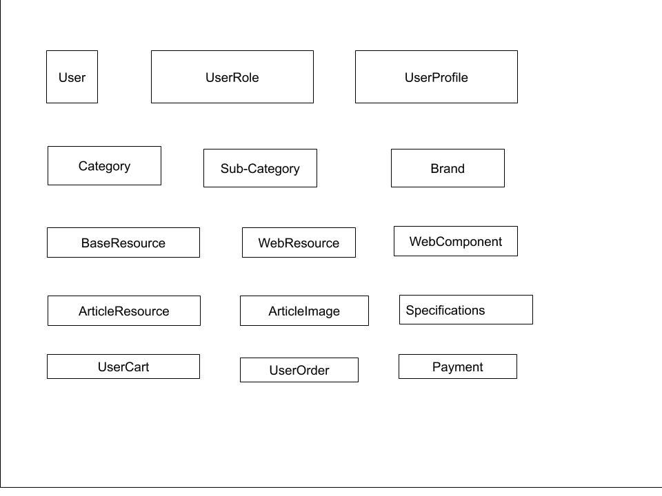

# Overview of Database Architecture

#### User
User component that stores basic info about user. Will use Django default user
model.

#### UserRole
Defines the roles of a user.

#### UserProfile
Store extra information about user. Like profile picture, address, etc.

#### BaseResource
Every resource in this system like article(product), web pages, and others if
needed, should inherit this component.

#### WebResource
Web resources are the web pages that will be added in the website.

#### WebComponent
These are the components that will be displayed in the website. Each WebResource
will include one or many of these components.

#### ArticleResource
These are used if the website is an e-commerce. They are basically the products
that will be displayed in the website.

#### ArticleImage
These are the images of an article. There may be multiple images for a single article.

#### Specifications
These are the specifications of an article. It will be divided into three blocks:
__SpecificationTitle__, __SpecificationContent__, __ArticleSpecification__.

#### UserCart
Store the cart information of a user

#### Order
Orders placed by User.

#### Payment
Information about the payment systems integrated in the system.

#### Category
Categories of articles.

#### SubCategory
Sub-categories of a category

#### Brand
Brands of Articles which the vendor can provide.